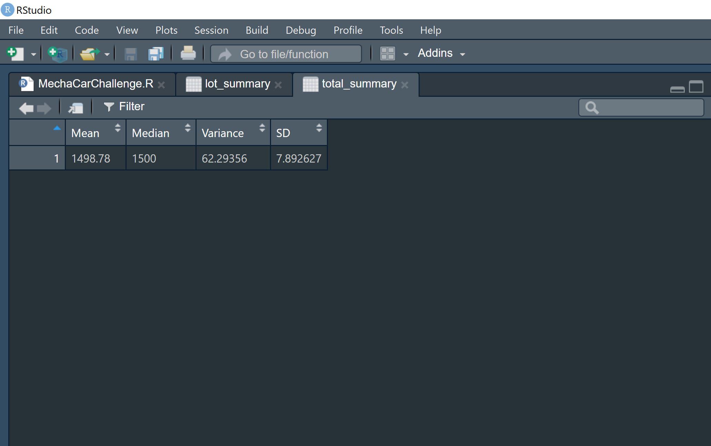
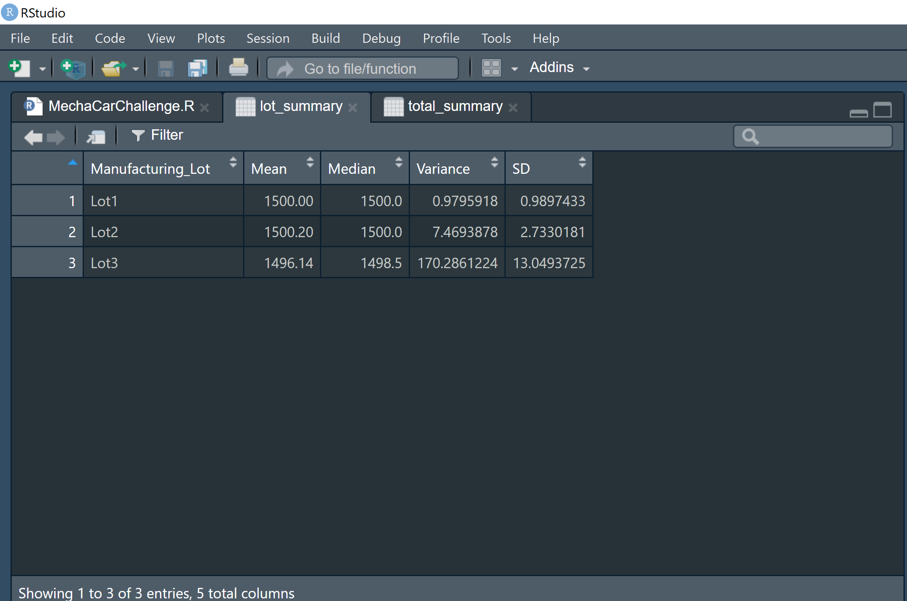
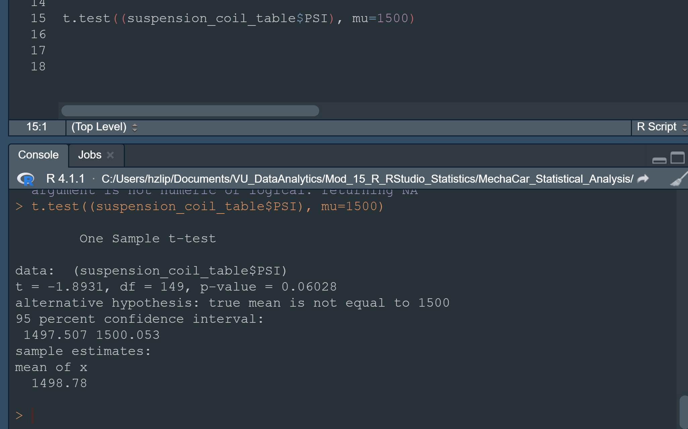
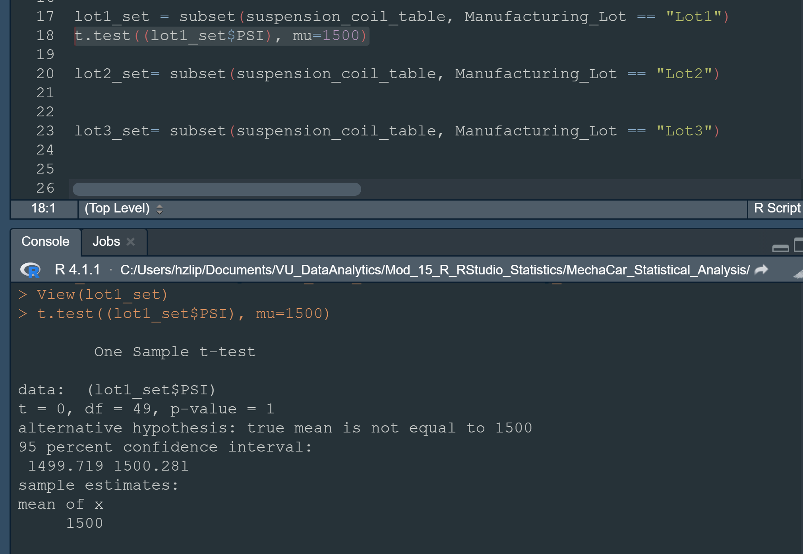
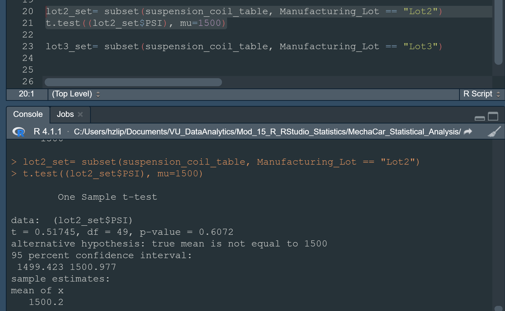
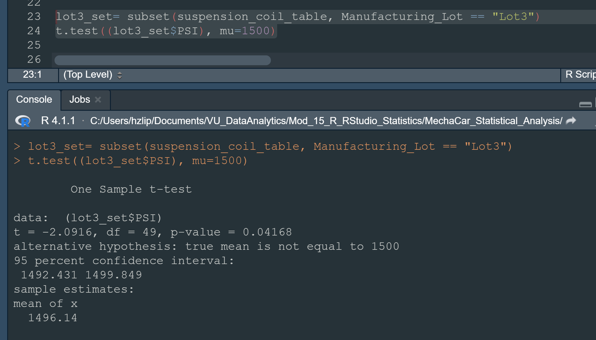

# MechaCar_Statistical_Analysis
## Linear Regression To Predict MPG
### Summary 1
- Multiple Linear Regression

- Summary Statistics of Multiple Linear Regression

### Which variables/coefficients provided a non-random amount of variance to the mpg values in the dataset?
- Using a Statistical Significance Metric of .05, we find two variables with probable non-random variance: 
- Vehicle Length (p-value: 2.6E-12)
- Ground Clearance (p-value: 5.21e-08)
- (Note): Intercept also had a sufficently small p-value to conclude it was not random
### Is the slope of the linear model considered to be zero? Why or why not?
- The slope of the model is not considered to be zero. The combination of the Multiple R-Squared Value (.715) and the miniscule p-value tells us the there is sufficent evidence the slope of our linear model is not zero.
### Does this linear model predict mpg of MechaCar prototypes effectively? Why or why not?
- In this case it predicts the MPG fairly well. The r-squared value was .715 and the p-value was significant. On the other hand, there is evidence of overfitting, because there is a lack of significant variables out of the six.

## Summary Statistics on Suspension Coil
- Suspension Coil Summary Statistics

### The design specifications for the MechaCar suspension coils dictate that the variance of the suspension coils must not exceed 100 pounds per square inch. Does the current manufacturing data meet this design specification for all manufacturing lots in total and each lot individually? Why or why not?
- The variance of the total_summary conforms to the specifications, but is over halfway to the limit. Once you take the individual lots into account, it is clear that Lot3 is significantly over the design specs limit(170.3 PSI). Lot3 changes the total average by a significant margin, as Lot1 and Lot2 have minimal variance. 

## T-Tests on Suspension Coils
### T-Test All Manufacturing Lots
- We are using a significance level of .05 percent, and our P-Value is .06.  Therefore, the evidence is not sufficent to reject our null hypothesis, that the true mean is equal to 1500.

### T-Test Manufacturing Lot 1
- Since the p-value of lot 1 is 1, the null hypothesis will not be rejected. The null hypothesis is that the mean is equal to 1500.
###T-Test All Manufacturing Lots

### T-Test Manufacturing Lot 2
- The p-value of lot 2 is also too high to reject our null hypotheis. The p-value is .061.

### T-Test All Manufacturing Lot 3
- Manufacturing Lot 3 has a p-value of .042, which is less than our significance level of .05. The null hypothesis for Lot 3 can be rejected, our alternative hypothesis is that the true mean is not equal to 1500.

## Study Design: MechaCar vs Competition
### Statistical Study Blueprint for MechaCar vs the Competition
- For our statistical test, we will study how the highway fuel efficiency of MechaCar vehicles compares to the competition. We will create subsets for each general type of vehicle and compare them to their counterparts manufactured by the competition. The null hypothesis will be that there is no significant difference in the fuel efficiency brand to brand for a comparable vehicle type. The alternative hypothesis would be that the fuel efficiency varies from Mechacar to the competition even if the vehicles are the same type. We would use Two Sample t-tests to achieve our goals, this would allow us to compare the samples head to head. We would compare a sample of each type of Mechacar vs a sample of each type offered by the competition. Breaking down the fuel efficiency by types of car should ensure the variables are closely related. For example, if Mechacar offers less trucks and SUVs than the competition, then efficiency for the sample of automobiles would likely be skewed by this fact. We would need a dataset that has a large sample of each type of car offered by Mechacar and the competition that also contains the fuel efficiency metrics.
