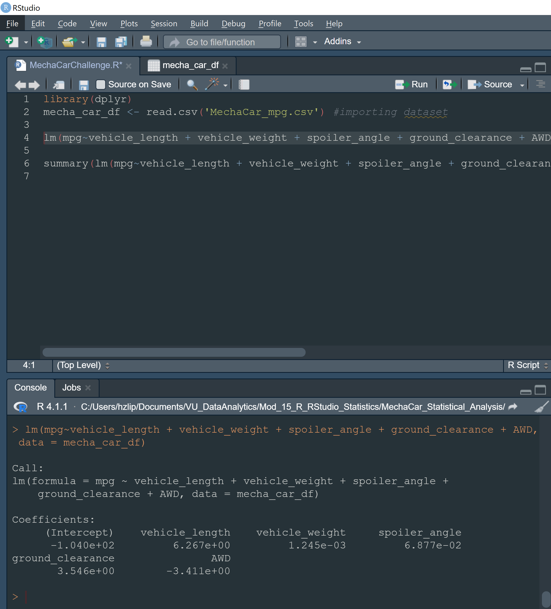
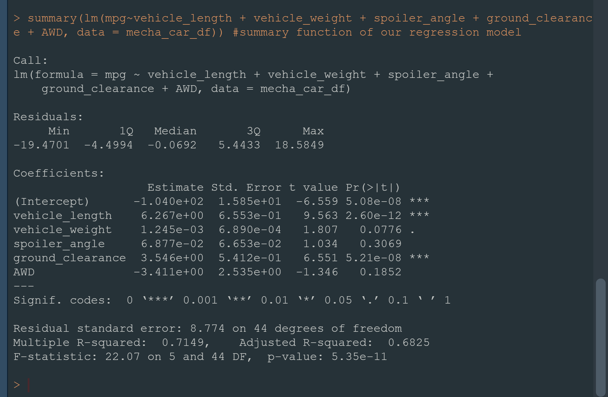

# MechaCar_Statistical_Analysis
## Linear Regression To Predict MPG
### Summary 1
- Multiple Linear Regression

- Summary Statistics of Multiple Linear Regression

Which variables/coefficients provided a non-random amount of variance to the mpg values in the dataset?
-  Using a Statistical Significance Metric of .05, we find two variables with probable non-random variance: 
- Vehicle Length (p-value: 2.6E-12)
- Ground Clearance (p-value: 5.21e-08)
### Is the slope of the linear model considered to be zero? Why or why not?
- The slope of the model is not considered to be zero. The combination of the Multiple R-Squared Value (.715) and the miniscule p-value tells us the there is sufficent evidence the slope of our linear model is not zero.
### Does this linear model predict mpg of MechaCar prototypes effectively? Why or why not?
- In this case it predicts the MPG fairly well, but is likely an example of overfitting, because the lack of significant variables.